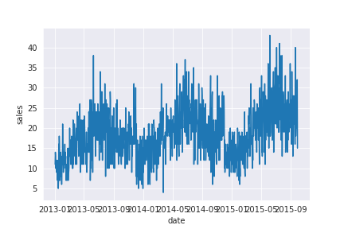
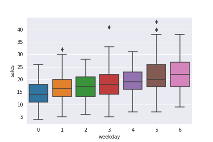
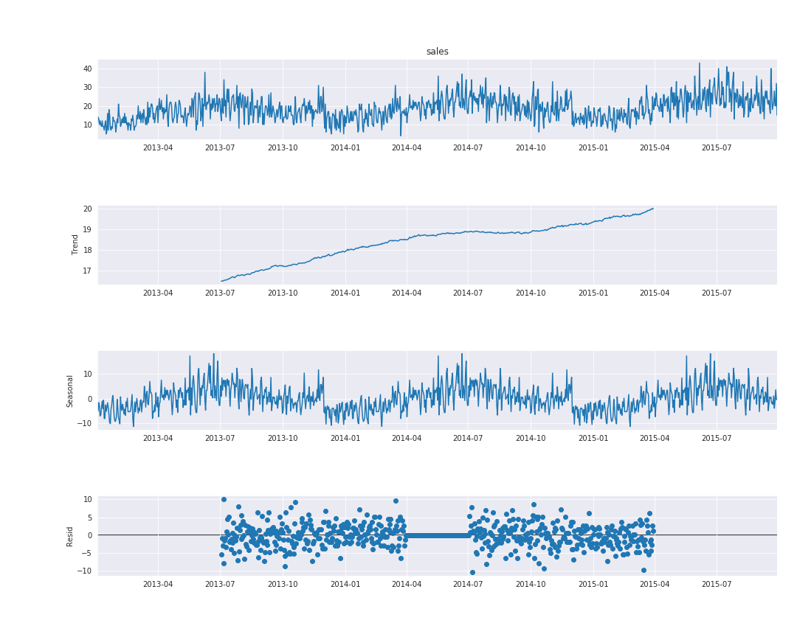
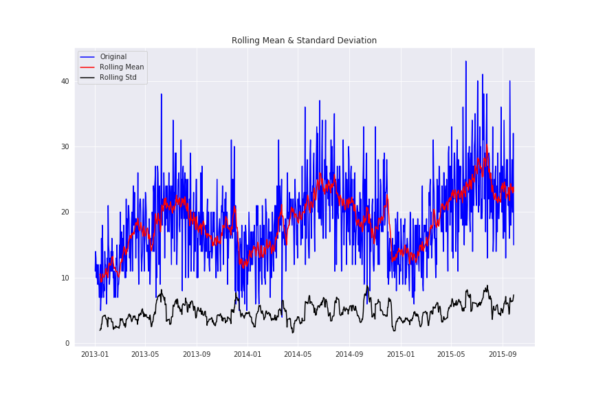

# Sales_Forecast

## Introduzione
Breve tutorial sull'approccio all'analisi di una serie temporale utilizzando modelli auto-regressivi.\
Si divide in:
- scomposizione dei dati per studiare:
  - stagionalità 
  - trend
  - i residui
  
- studio della stazionarietà dei dati tramite:
  - studio grafico
  - Dickey-Fuller test

- studio di ACF e PACF

- costruzione del modello ARIMA

- costruzione del modello SARIMA

- previsioni e valutazioni tramite il modello SARIMA

 ---
 
 ## Analisi
 
 per semplicità utilizzo solamente i primi 2 anni (circa) 
 
 - **Stagionalità e trend**
 
`sns.lineplot(x="date", y="sales",legend = 'full' , data=train_df)`

\
si vede chiaramente la presenza della stagionalità ed un trend crescente. 

Controlliamo la presenza di un trend settimanale:

`sns.boxplot(x="weekday", y="sales", data=train_df)`

 \
dal grafico possiamo vedere come in media ci sia un lieve trend crescente nelle vendite all'interno della settimana e che nei giorni infra-settimanali le vendite siano minori che nel weekend. 

Scomponiamo la stagionalità 

```
result = seasonal_decompose(train_df['sales'], model='additive', freq=365)
fig = plt.figure()
fig = result.plot()
fig.set_size_inches(15, 12)
```
\
vediamo che è presente un trend crescente e che è evidente un pattern annuale, inoltre deduciamo che chiaramente i dati non sono stazionari.

- **Rendere Stazionari i dati**\
Il prossimo step è quello di rendere stazionari i dati, cosa vuol dire stazionario?
1. vuol dire che la media della serie non deve essere funzione del tempo
2. la varianza della serie non deve essere funzione del tempo (omoschedasticità)
3. la covarianza dell'i-esimo termine e del (i+m)-esimo termine non devono essere funzione del tempo

**studio grafico e Dickey-Fuller test**
```
def test_stationarity(timeseries, window = 12, cutoff = 0.01):

    # calcolo delle medie mobili
    rolmean = timeseries.rolling(window).mean()
    rolstd = timeseries.rolling(window).std()

    # grafico delle medie mobili
    fig = plt.figure(figsize=(12, 8))
    orig = plt.plot(timeseries, color='blue',label='Original')
    mean = plt.plot(rolmean, color='red', label='Rolling Mean')
    std = plt.plot(rolstd, color='black', label = 'Rolling Std')
    plt.legend(loc='best')
    plt.title('Rolling Mean & Standard Deviation')
    plt.show()

    # calcolo Dickey-Fuller test:
    print('risultato Dickey-Fuller Test:')
    dftest = adfuller(timeseries, autolag='AIC', maxlag = 20 )
    dfoutput = pd.Series(dftest[0:4], index=['statistica test','p-value','#Lags usati','numero di osservazioni usate'])
    for key,value in dftest[4].items():
        dfoutput['valore critico (%s)'%key] = value
    pvalue = dftest[1]
    if pvalue < cutoff:
        print('p-value = %.4f. la serie è stazionaria' % pvalue)
    else:
        print('p-value = %.4f. la serie è non-stazionaria' % pvalue)

    print(dfoutput)

test_stationarity(train_df['sales'])
```

nel seguente grafico vediamo chiaramente che la serie non è stazionaria nonostante il p-value sia significativo al 5%.



Utilizziamo quindi una soglia più rigida per avere più fiducia nel nostro risultato.
```
risultato Dickey-Fuller Test:
p-value = 0.1469. la serie è non-stazionaria
```
