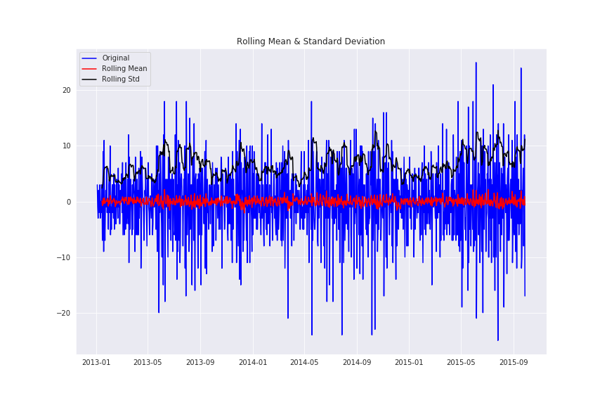
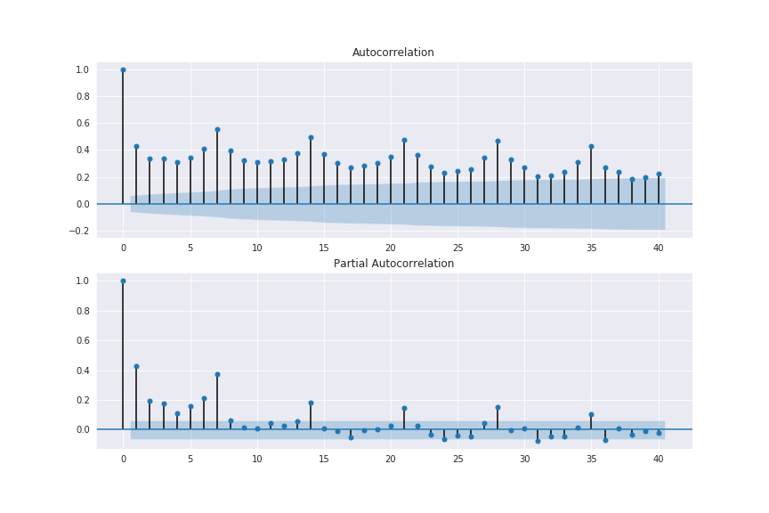
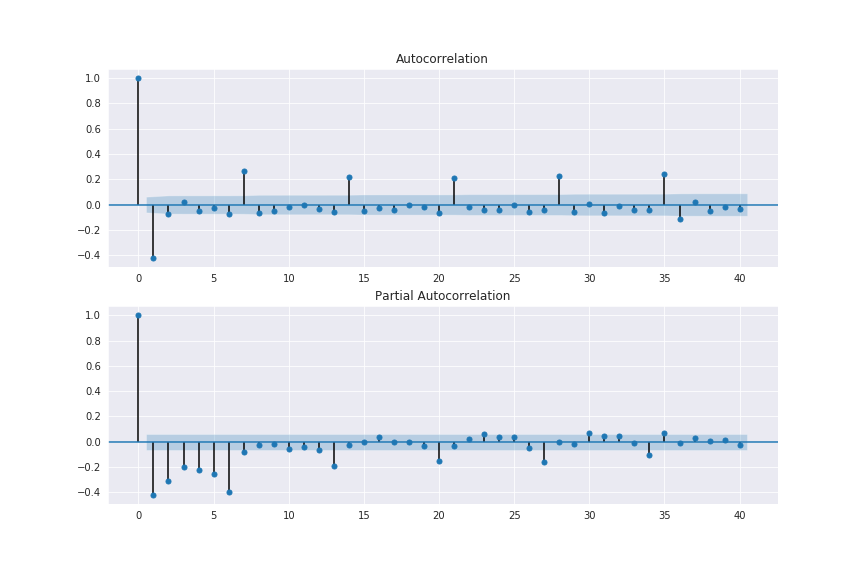
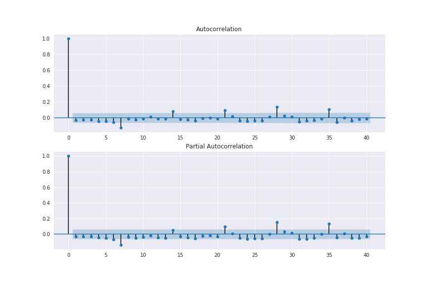

# Sales_Forecast

## Introduzione
Breve tutorial sull'approccio all'analisi di una serie temporale utilizzando modelli auto-regressivi.\
Si divide in:
- scomposizione dei dati per studiare:
  - stagionalità 
  - trend
  - i residui
  
- studio della stazionarietà dei dati tramite:
  - studio grafico
  - Dickey-Fuller test

- studio di ACF e PACF

- costruzione del modello ARIMA

- costruzione del modello SARIMA

- previsioni e valutazioni tramite il modello SARIMA

 ---
 
 ## Analisi
 
 per semplicità utilizzo solamente i primi 2 anni (circa) 
 
 - **Stagionalità e trend**
 
`sns.lineplot(x="date", y="sales",legend = 'full' , data=train_df)`

\
si vede chiaramente la presenza della stagionalità ed un trend crescente. 

Controlliamo la presenza di un trend settimanale:

`sns.boxplot(x="weekday", y="sales", data=train_df)`

 \
dal grafico possiamo vedere come in media ci sia un lieve trend crescente nelle vendite all'interno della settimana e che nei giorni infra-settimanali le vendite siano minori che nel weekend. 

Scomponiamo la stagionalità 

```
result = seasonal_decompose(train_df['sales'], model='additive', freq=365)
fig = plt.figure()
fig = result.plot()
fig.set_size_inches(15, 12)
```
\
vediamo che è presente un trend crescente e che è evidente un pattern annuale, inoltre deduciamo che chiaramente i dati non sono stazionari.

- **Rendere Stazionari i dati**\
Il prossimo step è quello di rendere stazionari i dati, cosa vuol dire stazionario?
1. vuol dire che la media della serie non deve essere funzione del tempo
2. la varianza della serie non deve essere funzione del tempo (omoschedasticità)
3. la covarianza dell'i-esimo termine e del (i+m)-esimo termine non devono essere funzione del tempo

**studio grafico e Dickey-Fuller test**
```
def test_stationarity(timeseries, window = 12, cutoff = 0.01):

    # calcolo delle medie mobili
    rolmean = timeseries.rolling(window).mean()
    rolstd = timeseries.rolling(window).std()

    # grafico delle medie mobili
    fig = plt.figure(figsize=(12, 8))
    orig = plt.plot(timeseries, color='blue',label='Original')
    mean = plt.plot(rolmean, color='red', label='Rolling Mean')
    std = plt.plot(rolstd, color='black', label = 'Rolling Std')
    plt.legend(loc='best')
    plt.title('Rolling Mean & Standard Deviation')
    plt.show()

    # calcolo Dickey-Fuller test:
    print('risultato Dickey-Fuller Test:')
    dftest = adfuller(timeseries, autolag='AIC', maxlag = 20 )
    dfoutput = pd.Series(dftest[0:4], index=['statistica test','p-value','#Lags usati','numero di osservazioni usate'])
    for key,value in dftest[4].items():
        dfoutput['valore critico (%s)'%key] = value
    pvalue = dftest[1]
    if pvalue < cutoff:
        print('p-value = %.4f. la serie è stazionaria' % pvalue)
    else:
        print('p-value = %.4f. la serie è non-stazionaria' % pvalue)

    print(dfoutput)

test_stationarity(train_df['sales'])
```

nel seguente grafico vediamo chiaramente che la serie non è stazionaria nonostante il p-value sia significativo al 5%.

```
risultato Dickey-Fuller Test:
p-value = 0.1469. la serie è non-stazionaria
```


Utilizziamo quindi una soglia più rigida per avere più fiducia nel nostro risultato.

Adesso per rendere il processo stazionario possiamo usare diverse tecniche, come: logaritmo, differenze, ecc.
```
first_diff = train_df.sales - train_df.sales.shift(1)
first_diff = first_diff.dropna(inplace = False)
test_stationarity(first_diff, window = 12)
```
dopo aver utilizato la tecnica delle differenze otteniamo un p-value estremamente basso e un riscontro grafico sulla stazionarietà della serie.
```
risultato Dickey-Fuller Test:
p-value = 0.0000. la serie è stazionaria
```



- **ACF e PACF**

Grafici della serie storica non stazionaria
```
fig = plt.figure(figsize=(12,8))
ax1 = fig.add_subplot(211)
fig = sm.graphics.tsa.plot_acf(train_df.sales, lags=40, ax=ax1) #
ax2 = fig.add_subplot(212)
fig = sm.graphics.tsa.plot_pacf(train_df.sales, lags=40, ax=ax2)# , lags=40
```
da questi grafici vediamo che c'è la necessità di una media mobile



Grafici serie storica con media mobile
```
fig = plt.figure(figsize=(12,8))
ax1 = fig.add_subplot(211)
fig = sm.graphics.tsa.plot_acf(first_diff, lags=40, ax=ax1)
ax2 = fig.add_subplot(212)
fig = sm.graphics.tsa.plot_pacf(first_diff, lags=40, ax=ax2)
```
vediamo che sia ACF che PACF hanno pattern ricorrenti ogni 7 giorni ogni volta che viene incontrato un pattern come questo bisogna sospettare una stagionalità.



Quindi bisognerebbe pensare ad utilizzare un modello SARIMA che tiene conto della stagionalità.

- **Costruzione del modello**

```
arima_mod6 = sm.tsa.ARIMA(train_df.sales, (6,1,0)).fit(disp=False)
print(arima_mod6.summary())


                             ARIMA Model Results                              
==============================================================================
Dep. Variable:                D.sales   No. Observations:                  999
Model:                 ARIMA(6, 1, 0)   Log Likelihood               -3015.968
Method:                       css-mle   S.D. of innovations              4.948
Date:                Wed, 27 May 2020   AIC                           6047.936
Time:                        18:37:03   BIC                           6087.190
Sample:                    01-03-2013   HQIC                          6062.856
                         - 09-28-2015                                         
=================================================================================
                    coef    std err          z      P>|z|      [0.025      0.975]
---------------------------------------------------------------------------------
const             0.0108      0.033      0.331      0.741      -0.053       0.075
ar.L1.D.sales    -0.8209      0.029    -28.245      0.000      -0.878      -0.764
ar.L2.D.sales    -0.7605      0.035    -21.702      0.000      -0.829      -0.692
ar.L3.D.sales    -0.6600      0.038    -17.593      0.000      -0.734      -0.586
ar.L4.D.sales    -0.6306      0.037    -16.846      0.000      -0.704      -0.557
ar.L5.D.sales    -0.5390      0.035    -15.410      0.000      -0.608      -0.470
ar.L6.D.sales    -0.3966      0.029    -13.653      0.000      -0.454      -0.340
                                    Roots                                    
=============================================================================
                  Real          Imaginary           Modulus         Frequency
-----------------------------------------------------------------------------
AR.1            0.6862           -0.8900j            1.1238           -0.1455
AR.2            0.6862           +0.8900j            1.1238            0.1455
AR.3           -1.0753           -0.5388j            1.2027           -0.4261
AR.4           -1.0753           +0.5388j            1.2027            0.4261
AR.5           -0.2904           -1.1383j            1.1748           -0.2898
AR.6           -0.2904           +1.1383j            1.1748            0.2898
-----------------------------------------------------------------------------
```

per vedere come performa il primo modello possiamo controllare che i residui siano distribuiti normalmente. Possiamo inoltre guardare ACF e PACF. Per un buon modello ci aspettiamo i residui normali e ACF e PACF con nessun termine significativo.

```
resid = arima_mod6.resid
print(normaltest(resid))
NormaltestResult(statistic=13.091317273020326, pvalue=0.0014363377464834469)
```



vediamo una correlazione ricorrente sia nel ACF che nel PACF, quindi dobbiamo lavorare con la stagionalità.

